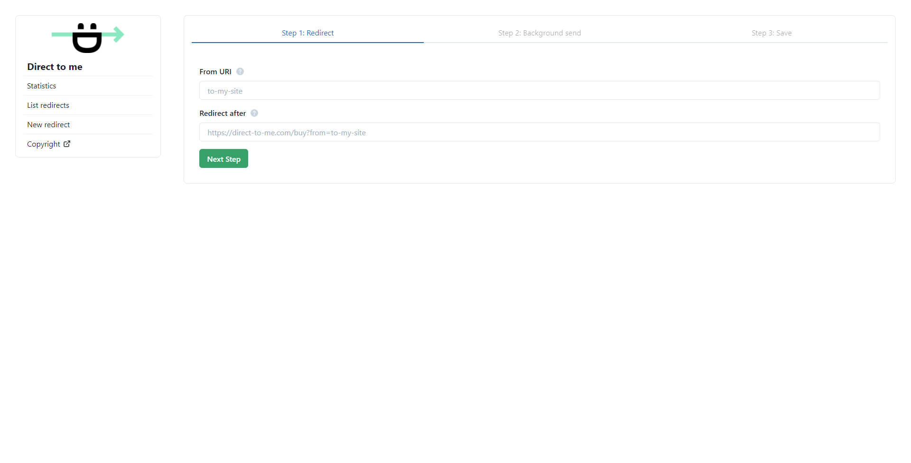

# Direct to me

Self-hosted application for redirecting user or application data in the background. Source code written in Go, TypeScript. React frontend.

👨‍🏭 Looking for contributors!

### Run in docker

```shell
docker pull ghcr.io/kiselev-nikolay/direct-to-me/direct-to-me:latest
docker run --name direct-to-me -p 8080:8080 ghcr.io/kiselev-nikolay/direct-to-me/direct-to-me:latest
```

Now check this out! Go to [localhost:8080](http://localhost:8080)

## Screenshots 😍





